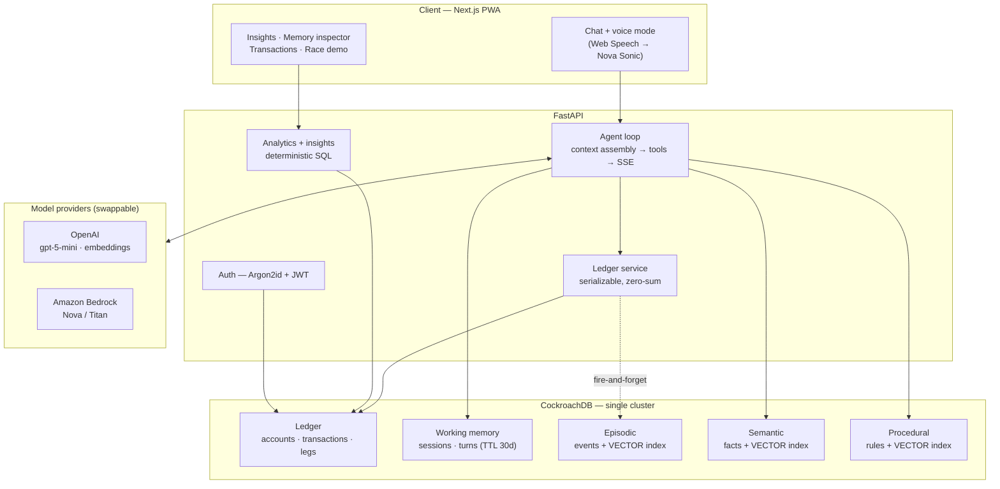

# Knot — Architecture

Knot is a voice-first personal finance agent whose defining property is that it
**remembers**. Money statements become balanced double-entry transactions; the
people, habits and rules of your financial life become durable agent memory,
recalled by meaning rather than exact match.

Both halves live in **one CockroachDB cluster**. That is the central design
claim: money needs strict serializable ACID, memory needs vector search, and
CockroachDB does both — so there is no second datastore to keep in sync, and a
memory write and a ledger write can share a transaction.

---

## System shape

---

## The ledger: correctness first

Every money event is a **double-entry transaction** — two or more legs that sum
to exactly zero (debits positive, credits negative). Balances are **always
derived** (`SUM` over legs); no mutable balance column exists anywhere, because
a stored balance is a cache that can drift and a derived one cannot.

Three properties are enforced rather than hoped for:

| Property | How |
|---|---|
| Legs sum to zero | Validated in Python **and** re-verified with `SELECT SUM` against the inserted rows, inside the same transaction, before commit. CockroachDB has no cross-row CHECK constraints, so this is deliberate. |
| No lost updates | Every write goes through `run_serializable()`, which sets `SERIALIZABLE`, catches CockroachDB's `40001` retry signal, and retries with jittered backoff. |
| Nothing is deleted | A disputed entry is **reversed** by a negating transaction. The original and its reversal both stay on the books, so plain `SUM`s net voided entries out automatically and the audit trail is intact. |

**The race demo** (`/demo`) makes this visible: ten concurrent settlements of the
same ₹500 debt. Under weaker isolation this is textbook write skew — every
request reads "₹500 outstanding", validates, and commits, and you get "paid
back" ₹5,000. Under CockroachDB serializable isolation exactly one commits, the
rest are cleanly rejected after retrying against the re-read balance, and the
ledger still sums to **₹0.00**.

---

## Memory: four stores, four retrieval strategies

The 2026 consensus (CoALA-style) is that collapsing agent memory into one
retrieval problem is the classic mistake. Knot keeps the four kinds separate,
each with storage and retrieval suited to it:

| Store | Holds | Written | Read |
|---|---|---|---|
| **Working** | The live conversation — turns + running summary | Every turn | Recency window, budgeted; raw turns expire via **Row-Level TTL (30d)** while distilled summaries persist |
| **Episodic** | What happened and when — transactions, settlements, insights | Auto-written on commit (fire-and-forget, never blocking the ledger) | Vector similarity, for "when did I last…" |
| **Semantic** | Durable facts — people, merchants, habits, commitments | Explicit tool + a background extraction pass | Vector similarity × confidence × recency decay |
| **Procedural** | Standing rules the user taught — splits, aliases, categorisation | User corrections; inferred repeats | Trigger-embedding match, injected as standing instructions |

Three decisions worth calling out:

- **Consolidation is transactional.** A new fact is vector-compared against
  existing facts *inside the same serializable transaction that writes it*.
  Near-duplicates reinforce the existing row (evidence count up, confidence up)
  instead of accumulating copies. Transactional vector search is precisely what
  a bolt-on vector database cannot offer.
- **Contradictions supersede, they don't delete.** A fact that is contradicted
  gets `superseded_by` set, so the inspector can show how a belief evolved.
- **Forgetting is real.** Raw conversation turns are disposable and TTL away;
  what survives is what was distilled. Confidence decays exponentially without
  reinforcement.

**Per-turn context assembly** runs all three vector lookups concurrently, then
records exactly which rules, facts and events were injected. That trace is
persisted with the turn and surfaced in the UI ("2 memories used"). It is not
just a nice inspector — it is how we caught the agent *appearing* to remember
while actually copying names out of its own prompt.

---

## The agent

A hand-rolled tool loop over the provider's chat API — no framework, because
memory design is the point and it must be legible in our own code.

12 tools across three families: ledger (`record_transaction`, `settle_up`,
`void_transaction`, `get_balances`, `list_recent_transactions`), money model
(`set_opening_balance`, `track_recurring`, `list_recurring`, `stop_recurring`),
and memory (`remember_fact`, `learn_rule`, `search_memory`). Voice reuses the
identical registry — the voice path never gets its own business logic.

**The LLM never writes SQL and never does arithmetic.** Queries are named
parameterised templates; analytics and insights compute every figure in SQL and
Python and hand the model already-true facts to phrase. A model that is never
asked to calculate cannot miscalculate.

---

## Providers are swappable

`LLM_PROVIDER` and `EMBEDDING_PROVIDER` select OpenAI or Amazon Bedrock behind
one protocol. Both providers emit **512-dimension** embeddings, so every
`VECTOR(512)` column is provider-independent and no migration is needed to
switch. (Embeddings are pinned per environment, never mid-flight: two providers'
vectors occupy different spaces even at equal dimensionality.)

---

## Production posture

- **Auth** — accounts with Argon2id password hashing and signed JWT sessions in
  httpOnly cookies. Identity comes from the verified token only; an earlier
  version trusted an `X-User` header, which meant anyone could read anyone's
  finances by changing it. There is a test that proves a forged header cannot
  impersonate an account.
- **Observability** — JSON structured logs (CloudWatch-ready) with method, path,
  status, duration; per-turn LLM and memory-assembly timings; every tool
  dispatch recorded in `agent_actions` with latency and errors.
- **Safety rails** — per-IP rate limiting on LLM-backed endpoints, CSV export
  hardened against spreadsheet formula injection, idempotency keys (TTL'd) so a
  double-tapped voice command cannot double-post.
- **Design system** — colour, type and spacing live as tokens; seven grep gates
  (`npm run check:tokens`) keep raw values out of components.

---

## CockroachDB and AWS usage

**CockroachDB**
1. **Distributed vector indexing** — three `CREATE VECTOR INDEX`es (episodic,
   semantic, procedural), each prefixed by `user_id` so similarity search is
   always scoped to one user. Consolidation performs similarity search *inside*
   the writing transaction.
2. **`ccloud` CLI** — cluster provisioning, SQL user creation and connection
   retrieval (`scripts/provision.sh`).
3. **Cloud MCP Server** — schema exploration and query debugging during
   development, wired in `.mcp.json`.
4. **Docs MCP Server** — used throughout; feedback in `docs/crdb-tools-feedback.md`.

Also load-bearing: serializable isolation with explicit 40001 retry handling,
Row-Level TTL on three tables, and JSONB for tool arguments and rule payloads.

**AWS** — Amazon Bedrock (Titan embeddings, Nova/Claude chat, Nova Sonic voice)
behind the provider protocol; deployment on App Runner with S3-backed exports
and CloudWatch logging.
